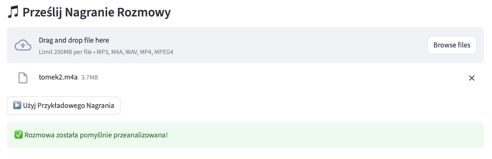

# CAll Agent POC (Streamlit)
[**CAll Agent POC**](https://callagent.streamlit.app) is a demo application for processing phone call recordings with an AI agent, designed for easy integration into your workflow. The app allows you to upload an audio file, sends it to an n8n workflow for processing (transcription, analysis, meeting detection, etc.), and displays the results in a user-friendly dashboard.

You can upload your own audio recording or use the provided example recording, which will be downloaded directly from Google Drive.

---

### Key Features
- **Automatic Transcription**: The backend (n8n) use Whisper to transcribe audio.
- **AI Analysis**: Analyze the content of the conversation using GPT-4 for summaries, action items, or sentiment.
- **Meeting Detection**: Detect and extract meeting details (title, date, time, participants, description) from the conversation.
- **Calendar Integration**: Add detected meetings to Google Calendar.

---

